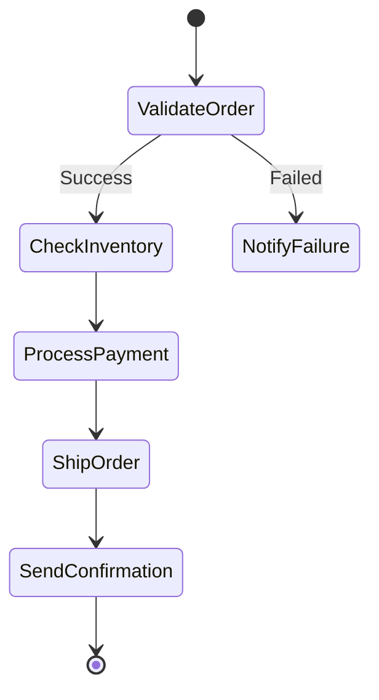

Here's a **refined breakdown** of AWS Step Functions state types with a **sample state machine JSON** that incorporates IAM roles for execution permissions:

---

### **Refined State Types Table**
| Type       | Purpose                          | Key Fields                          | IAM Consideration                     |
|------------|----------------------------------|-------------------------------------|---------------------------------------|
| **Task**   | Execute AWS service/work unit    | `Resource`, `Retry`, `Catch`       | Needs `states:StartExecution` permission |
| **Choice** | Branch logic (if/else)           | `Choices`, `Default`                | None                                  |
| **Parallel**| Run branches concurrently       | `Branches`, `ResultPath`            | Child tasks need their own permissions |
| **Map**    | Process array items in parallel  | `ItemsPath`, `Iterator`             | Iterator tasks need execution role    |
| **Pass**   | Modify/forward data              | `Result`, `Parameters`              | None                                  |
| **Wait**   | Pause execution                  | `Seconds`, `Timestamp`              | None                                  |
| **Succeed**| End successfully                 | None                                | None                                  |
| **Fail**   | End with error                   | `Error`, `Cause`                    | None                                  |

---

### **Sample State Machine JSON with IAM Integration**
```json
{
  "Comment": "Order Fulfillment Workflow with IAM Roles",
  "StartAt": "ValidateOrder",
  "States": {
    "ValidateOrder": {
      "Type": "Task",
      "Resource": "arn:aws:lambda:us-east-1:123456789012:function:validateOrder",
      "Next": "CheckInventory",
      "Retry": [{
        "ErrorEquals": ["Lambda.ServiceException"],
        "IntervalSeconds": 2,
        "MaxAttempts": 3
      }],
      "Catch": [{
        "ErrorEquals": ["States.ALL"],
        "Next": "NotifyFailure"
      }]
    },
    "CheckInventory": {
      "Type": "Parallel",
      "Next": "ProcessPayment",
      "Branches": [
        {
          "StartAt": "CheckWarehouseA",
          "States": {
            "CheckWarehouseA": {
              "Type": "Task",
              "Resource": "arn:aws:lambda:us-east-1:123456789012:function:checkInventory",
              "Parameters": {
                "warehouse": "A"
              },
              "End": true
            }
          }
        },
        {
          "StartAt": "CheckWarehouseB",
          "States": {
            "CheckWarehouseB": {
              "Type": "Task",
              "Resource": "arn:aws:lambda:us-east-1:123456789012:function:checkInventory",
              "Parameters": {
                "warehouse": "B"
              },
              "End": true
            }
          }
        }
      ]
    },
    "ProcessPayment": {
      "Type": "Task",
      "Resource": "arn:aws:states:::lambda:invoke",
      "Parameters": {
        "FunctionName": "arn:aws:lambda:us-east-1:123456789012:function:processPayment",
        "Payload.$": "$"
      },
      "Next": "ShipOrder",
      "IAMRolePath": "/service-roles/StepFunctions-PaymentExecution"
    },
    "ShipOrder": {
      "Type": "Map",
      "ItemsPath": "$.items",
      "MaxConcurrency": 5,
      "Iterator": {
        "StartAt": "ShipItem",
        "States": {
          "ShipItem": {
            "Type": "Task",
            "Resource": "arn:aws:states:::ecs:runTask",
            "Parameters": {
              "Cluster": "arn:aws:ecs:us-east-1:123456789012:cluster/shipping-cluster",
              "TaskDefinition": "shipping-task:1"
            },
            "End": true
          }
        }
      },
      "Next": "SendConfirmation"
    },
    "SendConfirmation": {
      "Type": "Task",
      "Resource": "arn:aws:states:::sns:publish",
      "Parameters": {
        "TopicArn": "arn:aws:sns:us-east-1:123456789012:order-notifications",
        "Message.$": "$"
      },
      "End": true
    },
    "NotifyFailure": {
      "Type": "Fail",
      "Error": "OrderFailed",
      "Cause": "Validation or inventory check failed"
    }
  }
}
```

---

### **Key IAM Integration Points**
1. **State Machine Execution Role**  
   Attach a role with:
   ```json
   {
     "Version": "2012-10-17",
     "Statement": [
       {
         "Effect": "Allow",
         "Action": [
           "lambda:InvokeFunction",
           "ecs:RunTask",
           "sns:Publish"
         ],
         "Resource": "*"
       }
     ]
   }
   ```

2. **Task-Specific Roles**  
   - Lambda tasks need `lambda:InvokeFunction`  
   - ECS tasks need `ecs:RunTask`  
   - SNS tasks need `sns:Publish`  

3. **Error Handling**  
   The `Catch` block in `ValidateOrder` uses IAM permissions to transition to `NotifyFailure`.

---

### **Visual Flow**


Would you like me to add specific retry logic for the ECS task or customize the IAM policies further?