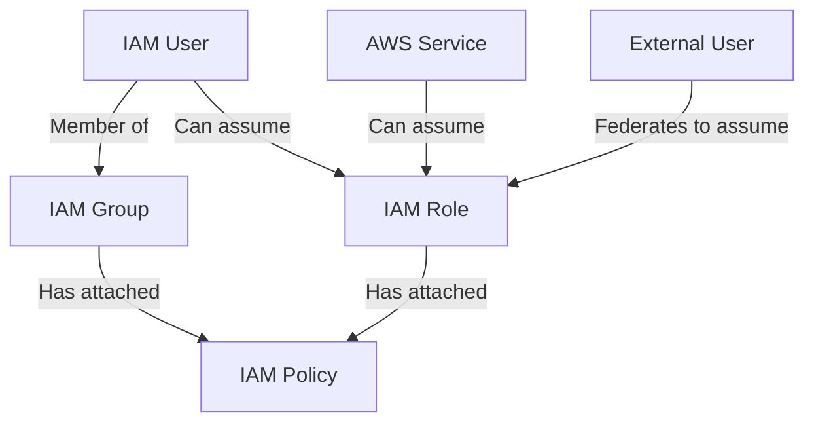

Here's a clear diagram-style breakdown of AWS IAM concepts and their relationships:

```
┌───────────────────────────────────────────────────────────────┐
│                        AWS IAM STRUCTURE                       │
├─────────────────┬─────────────────────────┬───────────────────┤
│   IAM ENTITIES  │    PERMISSION UNITS     │   ASSIGNMENT      │
│ (Who/What can   │     (Define access)     │   MECHANISMS      │
│  have access)   │                         │                   │
├─────────────────┼─────────────────────────┼───────────────────┤
│                 │                         │                   │
│  ┌─────────┐    │   ┌─────────────────┐   │  Policies can be: │
│  │  USER   │────┼──▶│    POLICIES     │◀──┼─• Attached        │
│  └─────────┘    │   │ (JSON documents)│   │  directly to      │
│      ▲          │   └─────────────────┘   │  users/groups/    │
│      │          │           ▲             │  roles            │
│  ┌───┴────┐     │           │             │                   │
│  │ GROUP  │     │           │             │  Roles are:       │
│  └────────┘     │   ┌───────┴───────┐     │  • Assumed by     │
│                 │   │      ROLE      │     │    users/services│
│  ┌─────────┐    │   └───────────────┘     │  • Not "assigned" │
│  │ SERVICE │────┼───────────┐             │    like policies  │
│  └─────────┘    │           │             │                   │
│                 │           │             │                   │
│  ┌─────────┐    │           ▼             │                   │
│  │FEDERATED│────┼───┌───────────────┐     │                   │
│  │  USER   │    │   │  PERMISSIONS  │     │                   │
│  └─────────┘    │   │  (Effective   │     │                   │
│                 │   │   Access)     │     │                   │
│                 │   └───────────────┘     │                   │
└─────────────────┴─────────────────────────┴───────────────────┘
```

### Key Relationships:
1. **Users**:
   - Can belong to multiple **Groups**
   - Can assume **Roles**
   - Can have **Policies** attached directly

2. **Groups**:
   - Contain multiple Users
   - Have Policies attached (inherited by all members)
   - Cannot assume Roles

3. **Roles**:
   - Assumed by Users/Services/Federated identities
   - Have Policies attached
   - Provide temporary credentials

4. **Policies**:
   - Define permissions (Allow/Deny actions on resources)
   - Can be attached to Users/Groups/Roles
   - Can be AWS-managed or customer-managed

### Flow Example:


### Permission Evaluation:
When an IAM entity makes a request, AWS checks:
1. All applicable Policies (user + group + role)
2. Combines them (union of permissions)
3. Applies any explicit denies first

Would you like a specific use-case example or a comparison table?


  
Core Concepts Refined:  
  
1. IAM Users  
  
Represents a person or app.  
  
Can have policies directly attached to them.  
  
Can be part of one or more groups.  
  
  
2. IAM Groups  
  
A collection of IAM users.  
  
You attach policies to groups, and all users in that group inherit them.  
  
Groups cannot assume roles.  
  
  
3. IAM Roles  
  
Not assigned to users or groups in the same way.  
  
Roles are meant to be assumed, usually by:  
  
IAM users  
  
Services (e.g., Lambda, EC2)  
  
Federated identities  
  
  
Roles can have policies attached directly to them.  
  
  
4. Policies  
  
Documents (JSON) that define permissions.  
  
Can be:  
  
Inline policies (attached directly to a user, group, or role)  
  
Managed policies (AWS-managed or customer-managed, reusable)  
  
  
  
  
---  
  
Correct Flow (Rewritten):  
  
> In AWS IAM, you define users and optionally group them into groups. You attach policies to users or groups to grant permissions.  
Roles are different—they’re assumed temporarily by users or services, and they have their own attached policies.  
Policies are the core permission units and can be attached to users, groups, or roles directly.  
  
  
  
  
---  
  
Want a diagram-style breakdown or a quick table for visual reference?


In AWS Identity and Access Management (IAM) policies, the **Principal** is the entity that is allowed or denied access to a resource. It defines **who** (user, role, account, or service) is making a request to AWS.  
  
### Types of Principals in AWS Policies:  
1. **AWS Account** – An entire AWS account (`arn:aws:iam::123456789012:root`).  
2. **IAM Users and Roles** – Specific IAM users or roles (`arn:aws:iam::123456789012:user/Alice`).  
3. **AWS Services** – AWS services acting on behalf of users (e.g., `[ec2.amazonaws.com](http://ec2.amazonaws.com/)`).  
4. **Federated Identities** – External users authenticated via Amazon Cognito or IAM federation.  
  
### Example 1: Principal as an AWS Account  
```json  
{  
"Effect": "Allow",  
"Principal": {  
"AWS": "arn:aws:iam::123456789012:root"  
},  
"Action": "s3:PutObject",  
"Resource": "arn:aws:s3:::my-bucket/*"  
}  
```  
This allows the entire AWS account `123456789012` to upload objects to `my-bucket`.  
  
### Example 2: Principal as a Specific IAM Role  
```json  
{  
"Effect": "Allow",  
"Principal": {  
"AWS": "arn:aws:iam::123456789012:role/MyRole"  
},  
"Action": "s3:GetObject",  
"Resource": "arn:aws:s3:::my-bucket/*"  
}  
```  
This allows only the IAM role `MyRole` to read objects from `my-bucket`.  
  
### Example 3: Principal as an AWS Service  
```json  
{  
"Effect": "Allow",  
"Principal": {  
"Service": "[lambda.amazonaws.com](http://lambda.amazonaws.com/)"  
},  
"Action": "sts:AssumeRole"  
}  
```  
This allows AWS Lambda to assume a role.  
  
### Where **Principal** is Used:  
- **Resource-based Policies** (S3, SNS, SQS, Lambda, etc.).  
- **Trust Policies** (IAM roles defining who can assume them).  
- **Service Control Policies (SCPs)** (when restricting permissions at the account or organizational level).  
  
### **When to Omit Principal**  
- **IAM Policies**: No need to specify `Principal` since they apply directly to the IAM user or role.  
- **Service Control Policies (SCPs)**: Apply to all entities in an AWS Organization by default.  
  
Let me know if you need further clarification!