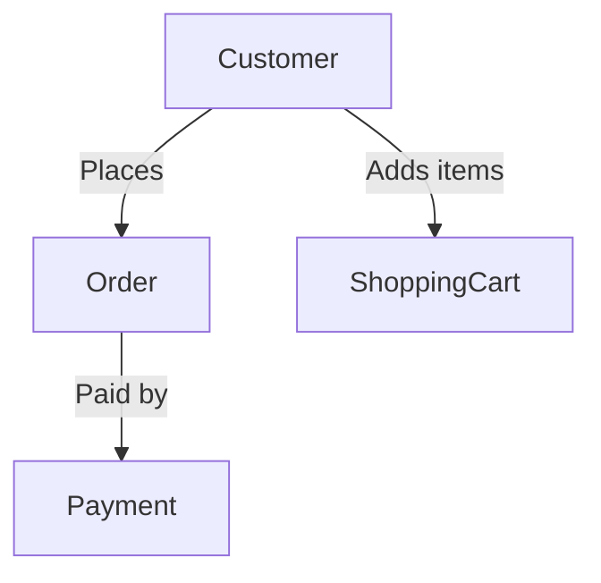

![[Pasted image 20240620142902.png]]





View > Component > Modules > Interfaces


Creating a high-level relationship flow between objects and denoting relationships with verbs involves several steps. I'll guide you through the process of developing a high-level relationship flow, identifying key relationships and then drawing lines between objects to depict these relationships with appropriate verbs. We'll start with defining the overall structure, followed by a use case diagram, and then delve into the specific relationships.

### Step 1: Define the High-Level Structure
Let's consider a simple example of an e-commerce platform to explain the process. Here are the primary entities we might consider:

- User
- Product
- Order
- Shopping Cart
- Payment

### Step 2: Use Case Diagram
A use case diagram helps identify interactions between users and the system. Here’s a simple use case diagram for our e-commerce example:

1. **User**: Registers, logs in, browses products, adds products to the shopping cart, places an order, makes a payment.
2. **Product**: Viewed by user, added to shopping cart by user, included in order.
3. **Order**: Created by user, paid by user.
4. **Shopping Cart**: Holds products, checked out by user.
5. **Payment**: Processed for an order.

### Step 3: Identify Relationships
From the use case diagram, we can identify the relationships and the verbs that describe them:

- **User** registers/logs in
- **User** browses **Product**
- **User** adds **Product** to **Shopping Cart**
- **User** places **Order**
- **User** makes **Payment**
- **Order** includes **Product**
- **Order** is paid with **Payment**

### Step 4: Draw High-Level Relationship Flow
Now, let's draw the relationships between these objects and denote the verbs:

1. **User** --- registers/logs in ---> **System**
2. **User** --- browses ---> **Product**
3. **User** --- adds to ---> **Shopping Cart**
4. **User** --- places ---> **Order**
5. **User** --- makes ---> **Payment**
6. **Order** --- includes ---> **Product**
7. **Order** --- is paid with ---> **Payment**

### Diagram
Here is a textual representation of how you might draw the lines between objects and denote the relationships with verbs:

```plaintext
   +-------+                             +--------+
   |       |                             |        |
   | User  +---------- registers ------->| System |
   |       |                             |        |
   +-------+                             +--------+
       |                                      ^
       |                                      |
       |                                      |
browses|                                      | logs in
       v                                      |
   +-------+                                  |
   |       |                                  |
   | Product|<--------- includes -------------+
   |       |            (by Order)
   +-------+
       |
adds to|
       v
+-----------+
|           |
| Shopping  |
| Cart      |
|           |
+-----------+
       |
places |
       v
   +--------+
   |        |
   | Order  +------------ makes --------> +---------+
   |        |                            | Payment |
   +--------+                            +---------+
```

### Step 5: Create a Data Model
From the relationships, we can start developing a more detailed data model. Here’s an outline of what the data model might look like:

1. **User**:
   - ID
   - Name
   - Email
   - Password
   - (Other user details)

2. **Product**:
   - ID
   - Name
   - Description
   - Price
   - Stock
   - Category

3. **Order**:
   - ID
   - UserID
   - Date
   - TotalAmount
   - Status

4. **Shopping Cart**:
   - ID
   - UserID
   - ProductID
   - Quantity

5. **Payment**:
   - ID
   - OrderID
   - Amount
   - PaymentMethod
   - Status
   - Date

### Relationships
- **User** has many **Orders**
- **Order** belongs to **User**
- **Order** has many **Products** (through a join table)
- **Product** has many **Orders** (through a join table)
- **Shopping Cart** belongs to **User**
- **Shopping Cart** has many **Products**
- **Payment** belongs to **Order**

### Step 6: Draw the Data Model Diagram
Here's a high-level Entity-Relationship Diagram (ERD):

```plaintext
+--------+                 +--------+
|  User  |                 |  Order |
+--------+                 +--------+
| ID     | 1          M    | ID     |
| Name   +---------------> | UserID |
| Email  |                 | Date   |
| Password|                | Total  |
+--------+                 +--------+
     |                          |
     |                          |
     |                          |
     v                          v
+-----------+              +-----------+
| Shopping  |              | Payment   |
| Cart      |              +-----------+
+-----------+              | ID        |
| ID        |              | OrderID   |
| UserID    |              | Amount    |
| ProductID |              | Method    |
| Quantity  |              | Status    |
+-----------+              +-----------+
     |
     |
     v
+-----------+
|  Product  |
+-----------+
| ID        |
| Name      |
| Desc      |
| Price     |
| Stock     |
| Category  |
+-----------+
```

In this ERD:
- A **User** can have multiple **Orders**.
- An **Order** can include multiple **Products**.
- A **Shopping Cart** contains multiple **Products** and is associated with a **User**.
- A **Payment** is associated with an **Order**.

By following these steps, you can create a comprehensive high-level relationship flow and data model that visually and textually represents the interactions and relationships between various entities in your system.